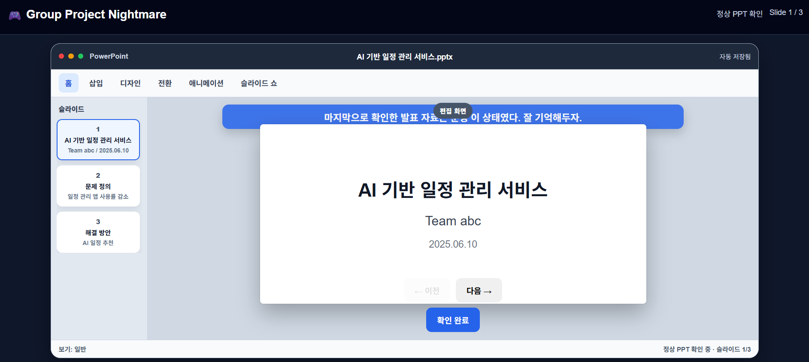

# Group Project Nightmare

발표 직전 망가진 PPT에서 이상현상을 찾아내는 클릭형 판별 게임입니다.



<p align="center">
  <a href="https://devalice.github.io/group-project-nightmare/">
    <strong>PLAY NOW</strong>
  </a>
</p>

## Game Info

| 항목 | 내용 |
| --- | --- |
| 장르 | 클릭형 이상현상 판별 게임 |
| 플레이 시간 | 약 3-5분 |
| 스테이지 | 총 16개 |
| 목표 | PPT 속 이상현상을 모두 정확히 판별하기 |
| 실행 환경 | 데스크톱 |

## Controls

| 조작 | 설명 |
| --- | --- |
| `다음` | 스토리 진행 |
| `← 이전` | 이전 슬라이드로 이동 |
| `다음 →` | 다음 슬라이드로 이동 |
| `이상현상 발견` | 현재 PPT에 이상현상이 있다고 판단 |
| `문제 없음` | 현재 PPT가 정상이라고 판단 |

## How To Play

1. 시작하면 스토리를 진행합니다.
2. 정상 PPT를 먼저 확인하고 기억합니다.
3. 각 스테이지에서 PPT를 넘겨 보며 이상한 부분이 있는지 확인합니다.
4. 이상현상이 있으면 `이상현상 발견`을 선택합니다.
5. 이상현상이 없으면 `문제 없음`을 선택합니다.
6. 한 번이라도 잘못 판단하면 게임 오버입니다.
7. 모든 스테이지를 통과하면 클리어입니다.

## Tech Stack

| 영역 | 기술 |
| --- | --- |
| Markup | HTML |
| Styling | CSS |
| Logic | Vanilla JavaScript |
| Assets | JPG, PNG |
| Build | 없음, 정적 웹 프로젝트 |

## Local Play

브라우저에서 `index.html`을 열면 바로 플레이할 수 있습니다.

로컬 서버로 실행하려면 프로젝트 루트에서 아래 명령어를 실행합니다.

```bash
python -m http.server 8000
```

그 다음 브라우저에서 접속합니다.

```text
http://localhost:8000
```

## Project Structure

```text
.
|-- index.html
|-- style.css
|-- app.js
|-- README.md
`-- assets/
```
